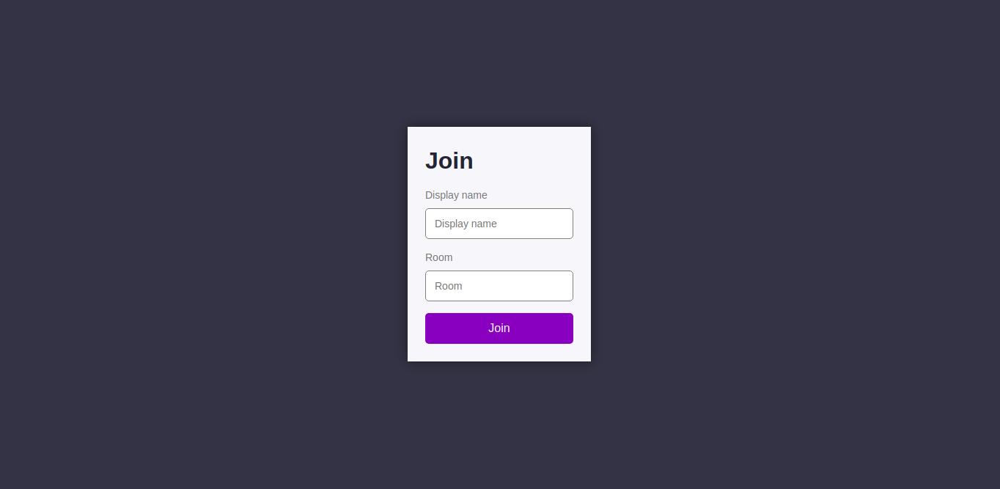

# Onyx Chat Rooms

 &nbsp;&nbsp;
 &nbsp;&nbsp;

When WhatsApp's down, Onyx Chat Rooms 📱 got you covered. No surveillance 👍 - Self deleting chats.

# How to use it ?
Just go to __[Onyx-Chat-Rooms](https://roopin-chat-app.herokuapp.com/)__, Choose your desired display name, create a new room and invite your friends to it.

# Features
- No history of chats will be recorded.
- Chat will delete itself once the room becomes empty.
- Sidebar displays list of active users in real time.
- You can share your live location as well.

# Tech Used
- Socket.io
- Node.js
- Express.js

# In Action

# Contribution
Feel free to raise issues, if you find any errors or have some suggestions that can make this application better.
